
<h1 align="center">机场网上订票系统</h1>

## 简介
机场网上订票系统：角色分为管理员、用户；功能包括机票信息管理、用户注册与登录、订单管理、航班详情录入、支付与广告管理，支持后台与个人中心操作，提升订票和管理效率。    --计算机毕业设计源码；毕设源码；java毕业设计源码

## 联系方式

<h3 align="center">获取完整代码与数据库文件 + 微信：deepguan QQ: 86050149 QQ群: 783742310</h3>

<h3 align="center">可帮忙远程部署 包运行成功！提供远程部署、修改代码、设计文档指导、代码讲解等服务！</h3>

## 功能介绍（完整见运行截图）
管理员：负责系统管理，包括用户管理、机票信息管理、订单信息管理、机场广告管理、系统公告和轮播图管理，支持登录、退出和前后台切换功能。可查看并编辑用户信息、航班详情、广告内容，维护系统安全及数据更新。

用户：提供基本注册、登录和退出功能。支持查询航班信息、查看航班详情、在线购票以及订单管理。个人中心可修改个人信息，查询订单历史和收藏的航班，提升用户体验和操作便捷性。

游客：无需登录即可浏览首页、查看航班信息、机场广告和系统公告。支持通过搜索栏快速查询航班和服务信息，同时了解最新的广告内容。

支付系统：集成多种支付方式（如支付宝），支持扫描二维码支付或直接账户支付，显示支付成功页面并提供交易记录、余额查询等功能，确保支付安全和可靠。

## 运行截图
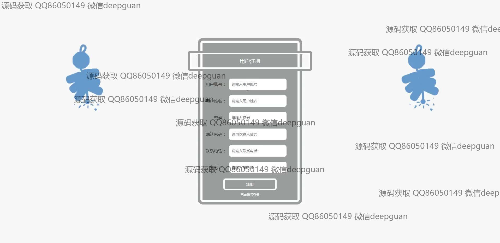
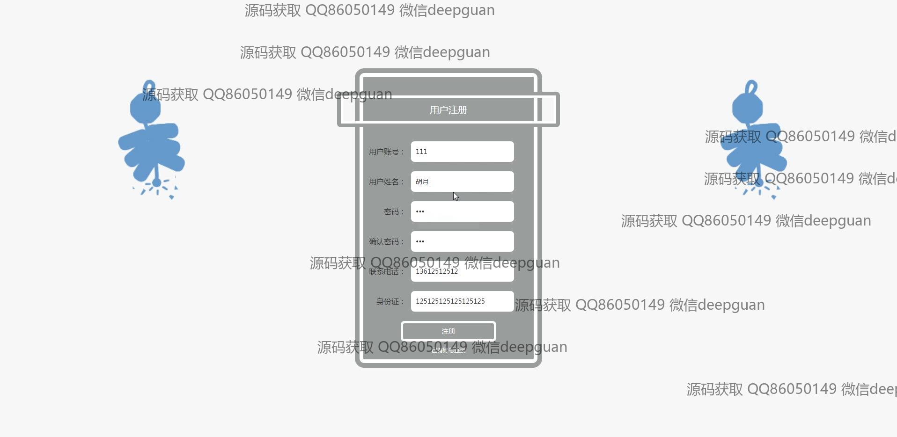
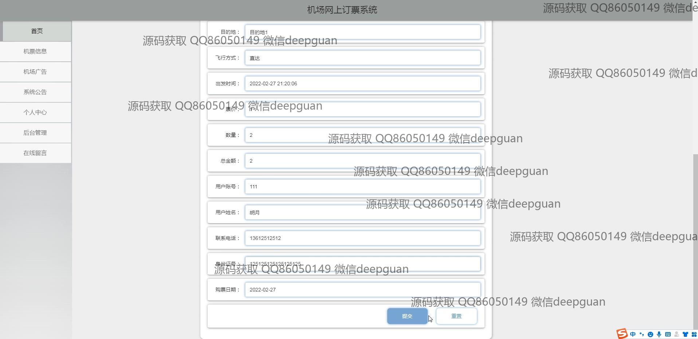
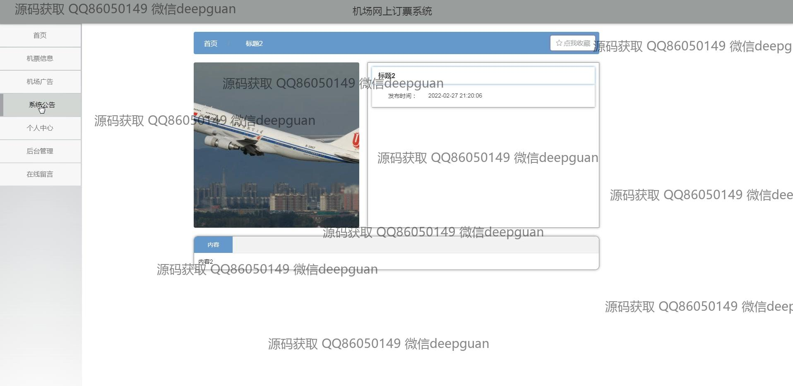
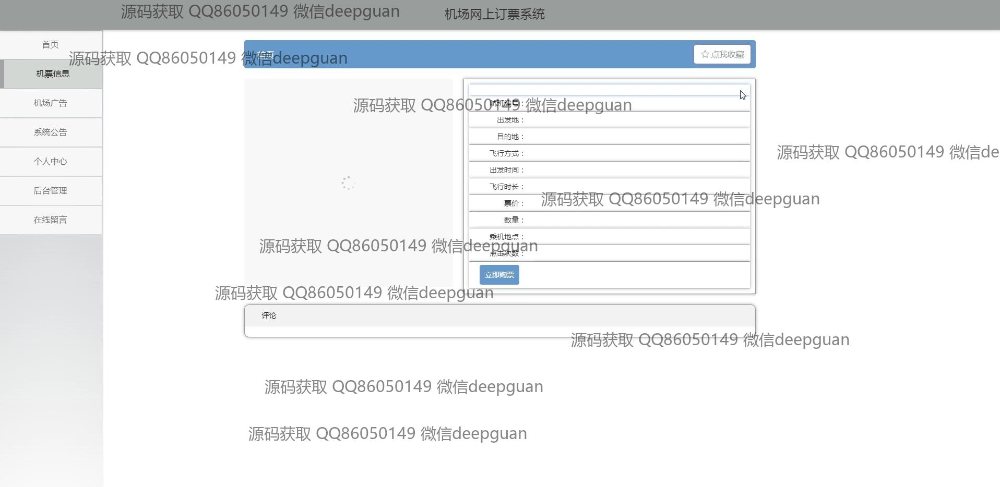
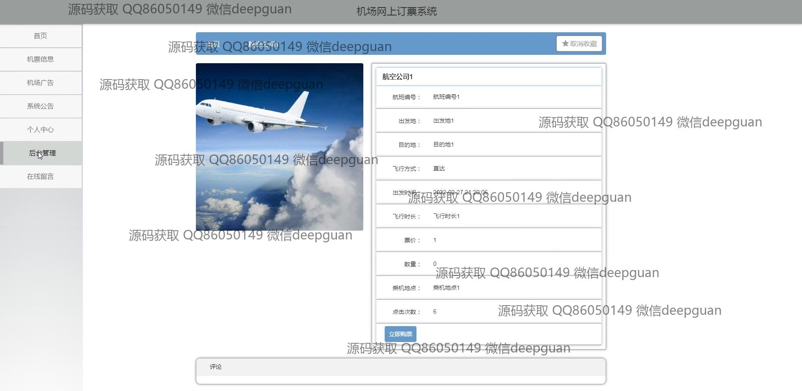
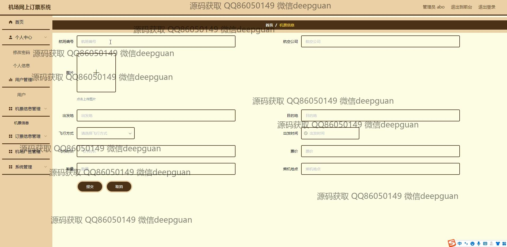
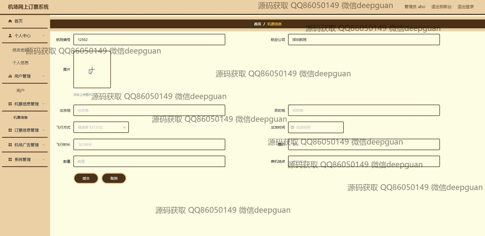
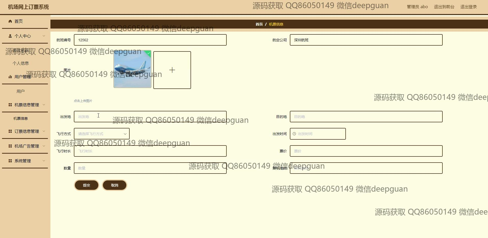
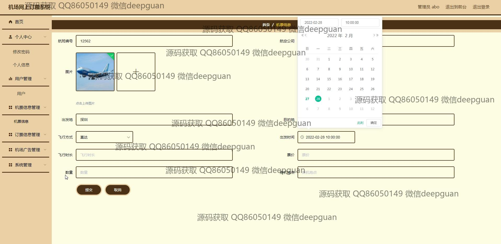
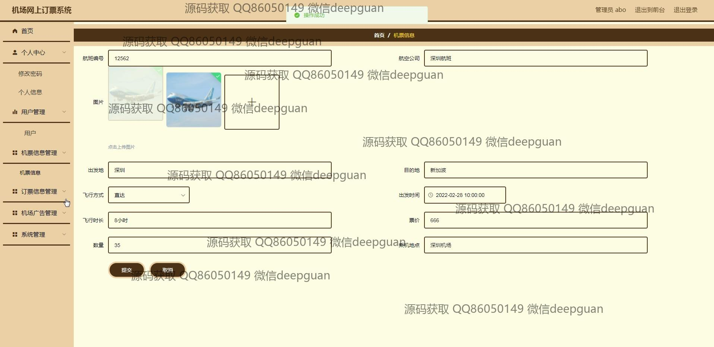
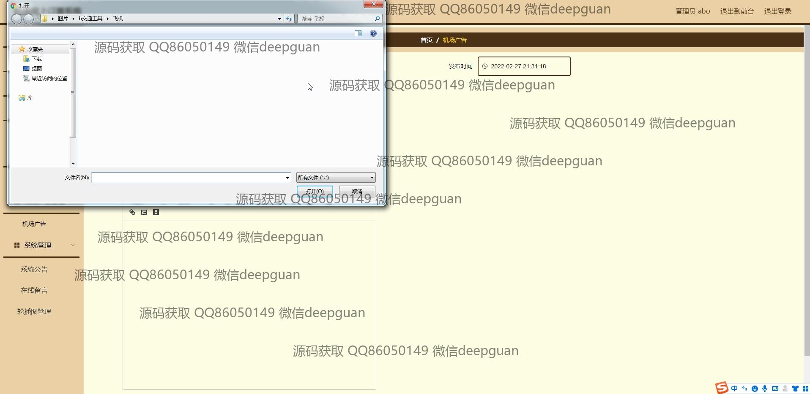
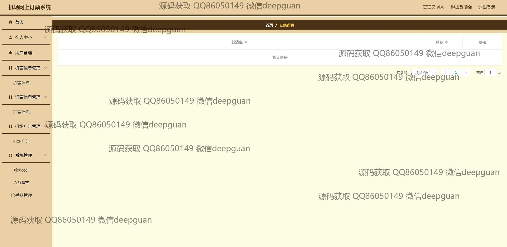
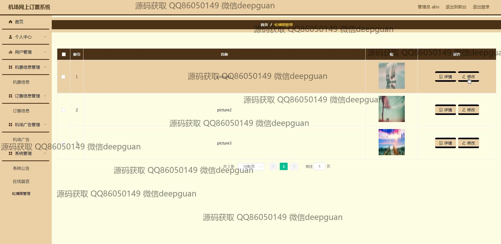
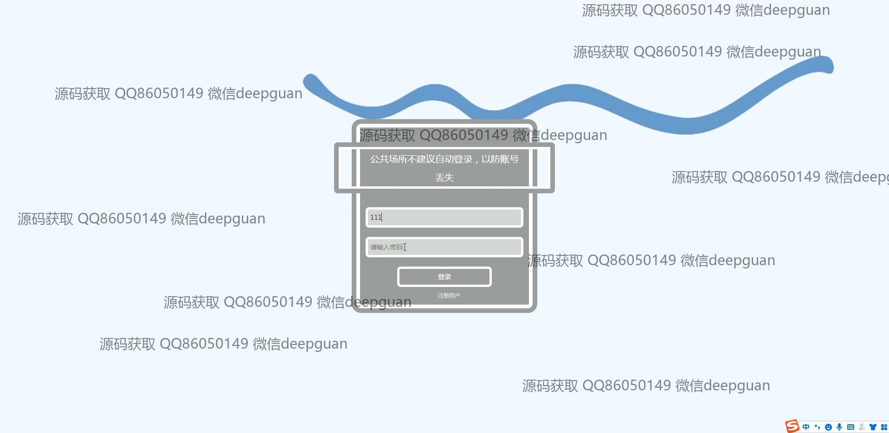
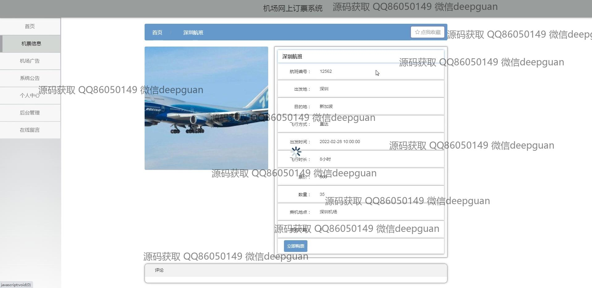
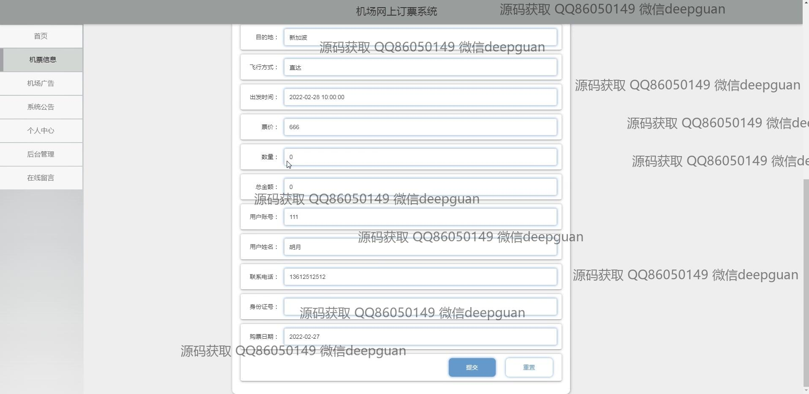
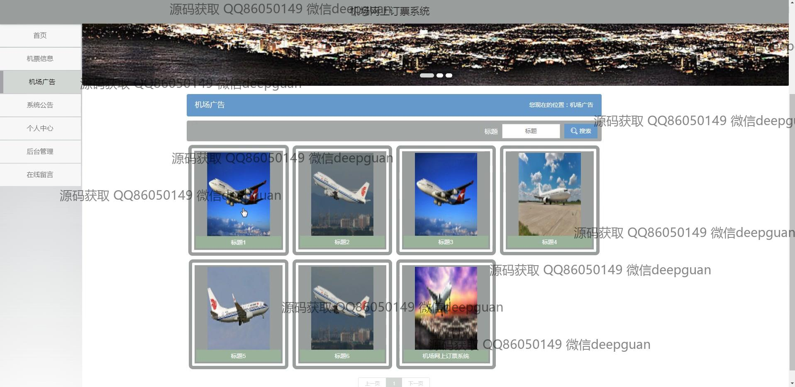
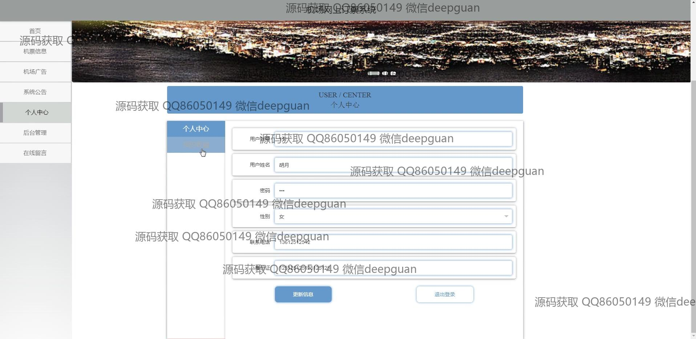
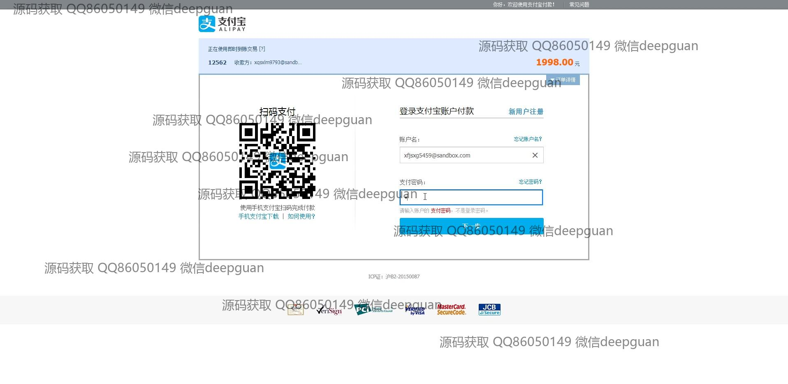
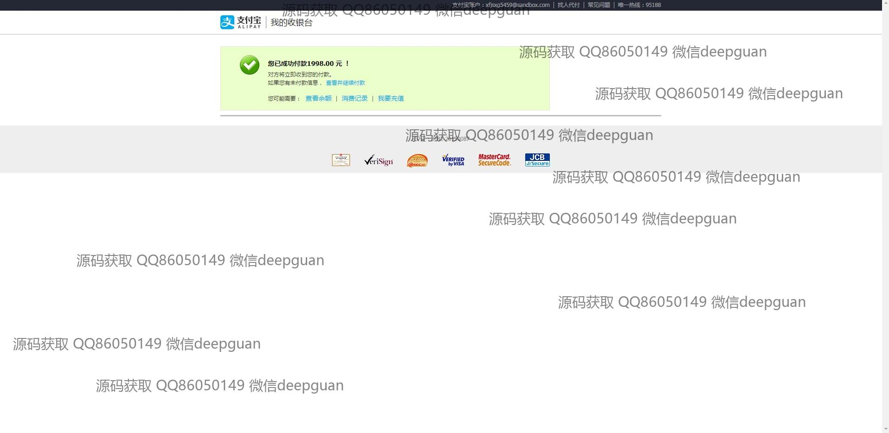

本代码来源于网络,仅供学习参考使用!

